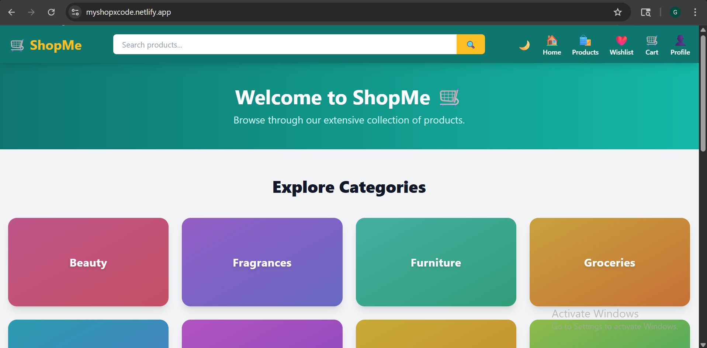
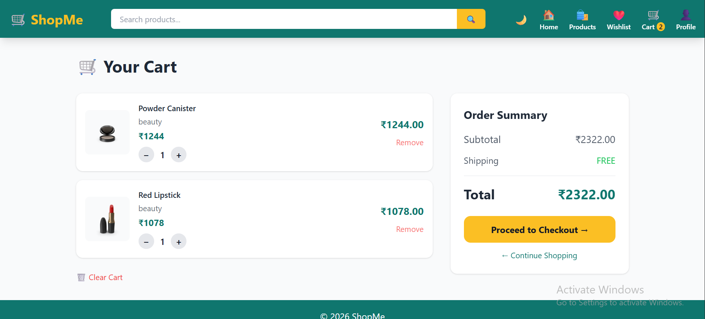
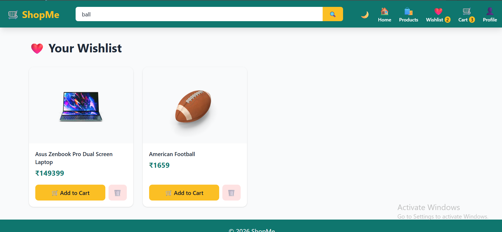
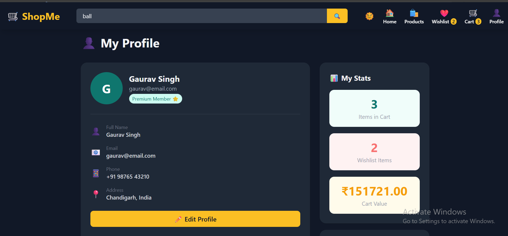
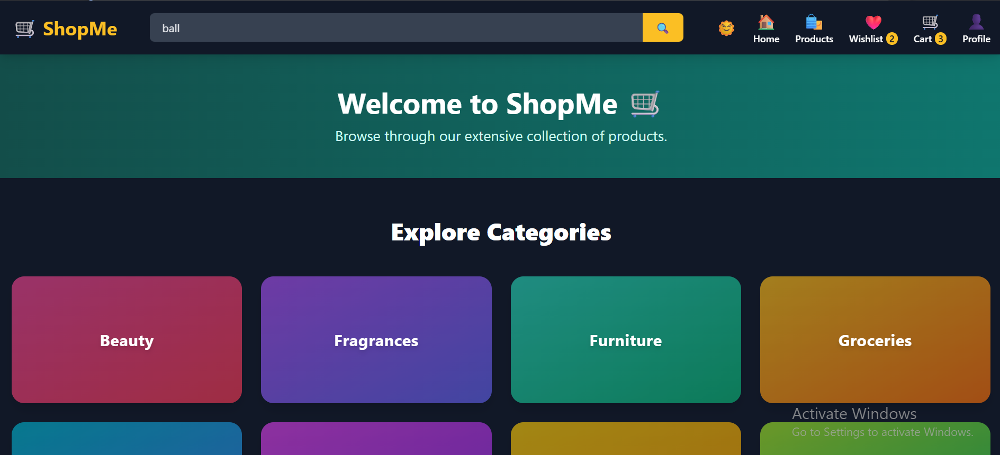

# ShopMe— E-Commerce Web Application

A modern, fully functional e-commerce web application built with React and Vite. MyShop offers a seamless shopping experience with product browsing, cart and wishlist management, checkout with multiple payment options, and a responsive dark/light theme.

---

## Live Demo

🔗 [https://myshopxcode.netlify.app/](https://myshopxcode.netlify.app/)

---

## Screenshots

---

## Features

- **Home Page** — Product grid with banner, real-time search, and category filtering
- **Product Detail Page** — Full product information, ratings, add to cart and wishlist
- **Cart** — Quantity controls, subtotal calculation, and order summary
- **Wishlist** — Save favourite products and move them to cart
- **Checkout** — Delivery form with Card, QR Code, and Cash on Delivery payment options
- **Profile** — Edit profile details, view cart and wishlist stats
- **Dark / Light Mode** — Full theme toggle with localStorage persistence
- **Search** — Real-time product search by name
- **Category Filter** — Filter by Electronics, Jewellery, Men's Clothing, and Women's Clothing

---

## Tech Stack

| Technology | Purpose |
|---|---|
| React + Vite | Frontend Framework & Build Tool |
| Redux Toolkit | Cart & Wishlist State Management |
| React Router DOM | Client-Side Routing |
| Tailwind CSS | UI Styling & Responsive Design |
| Context API | Dark / Light Theme Management |
| Fake Store API | Product Data Sour

---

## Folder Structure

MyShop/
├── public/
├── src/
│   ├── components/
│   │   ├── Navbar.jsx
│   │   ├── Footer.jsx
│   │   ├── ProductCard.jsx
│   │   └── Loader.jsx
│   ├── pages/
│   │   ├── Home.jsx
│   │   ├── ProductDetail.jsx
│   │   ├── Cart.jsx
│   │   ├── Wishlist.jsx
│   │   ├── Checkout.jsx
│   │   └── Profile.jsx
│   ├── redux/
│   │   ├── store.js
│   │   ├── CartSlice.js
│   │   └── WishlistSlice.js
│   ├── context/
│   │   └── ThemeContext.jsx
│   ├── App.jsx
│   ├── main.jsx
│   └── index.css
├── index.html
├── tailwind.config.js
├── vite.config.js
├── package.json
---

